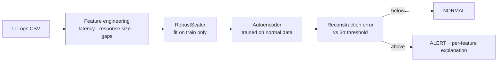

<div align="center">

# 🔎 API Workflow Anomaly Detection

### An autoencoder that learns what "normal" looks like, then tells you exactly *what* went wrong.


</div>

---

## 💡 The idea

A workflow is a chain of API calls: call A, then B, then C, each with its own latency, response size and the wait between steps. When something breaks, no single number is obviously wrong; the *pattern* is.

This project trains an **autoencoder on normal workflows only**. It learns to reconstruct healthy behaviour, so when an abnormal workflow comes in, the reconstruction is poor and the error spikes. No anomaly labels are needed for training, and every alert comes with an explanation.



---

## ⚙️ How it works

**1. One row per workflow.** Every workflow (grouped by `workflow_id`, ordered by `start`) is flattened into a single feature vector:

| Feature group | What it captures |
|---|---|
| `<api>_latency` | How long each API call took |
| `<api>_response_size` | How much data each call returned |
| `Gap_1 … Gap_n-1` | The idle time between consecutive calls (`max(0, next.start − prev.end)`, so overlaps never go negative) |

For a workflow of 7 API calls, that is 7 + 7 + 6 = **20 features**.

**2. Scale robustly.** `RobustScaler` (median and IQR) is fitted on the training data only, so a few extreme latencies don't distort the scale and nothing leaks from the test set.

**3. Learn "normal".** A symmetric autoencoder is trained on normal workflows only:

```
input → 32 → 16 → 8 (bottleneck) → 16 → 32 → output
        ReLU  ReLU   ReLU          ReLU  ReLU  sigmoid
```

Adam optimizer, MSE loss, up to 200 epochs with early stopping (patience 10, best weights restored).

**4. Set the threshold from training data.**

- **Workflow threshold:** `mean(train MSE) + 3 × std(train MSE)`
- **Feature thresholds:** the same rule applied to each feature's squared error

**5. Detect and explain.** Any test workflow above the workflow threshold is flagged `ALERT`. Then every feature above *its own* threshold is reported in original units (inverse-transformed), so you see what was observed against what a normal workflow would have looked like.

---

## 🧾 What an alert looks like

Each alert reports which API misbehaved, on which metric, and by how much. (Values below are illustrative.)

```json
{
  "workflow_id": 3520,
  "status": "ALERT",
  "anomaly_score": 0.8421,
  "deviations": [
    {
      "api": "<api_name>",
      "feature": "latency",
      "observed": 1840.5,
      "expected_normal": 212.3,
      "deviation": 1628.2
    }
  ]
}
```

Deviations are typed as `latency`, `response_size`, or `workflow_metric` (the gap features).

---

## 📁 Input data

Two CSV files in the project root:

| File | Contents |
|---|---|
| `training_data_2000.csv` | **Normal** workflows only |
| `testing_data_2000.csv` | Normal workflows plus anomalies |

Columns used: `workflow_id`, `api_name`, `start`, `end`, `latency`, `response_size`.

The script expects every workflow to have the same number of rows (one per API call, 7 in this dataset). Test workflows are shuffled with their rows kept together, so results don't depend on file order.

---

## 🚀 Setup and Execution

### 1. Create a virtual environment
```bash
python -m venv venv
```

### 2. Activate the environment
```bash
# Windows
venv\Scripts\activate

# macOS / Linux
source venv/bin/activate
```

### 3. Install dependencies
```bash
pip install -r requirements.txt
```

`requirements.txt` should contain:
```
tensorflow
pandas
scikit-learn
numpy
matplotlib
```

### 4. Run the program
```bash
python method1_fixed_v2_robustscaler.py
```

> ⚠️ **Before the first run:** the script was exported from a Colab notebook. Delete the `!pip install ...` line at the top (it is Colab-only syntax and fails in a normal `.py` file), and add `import matplotlib.pyplot as plt` to the imports, because the plotting section uses `plt` but its import is commented out.

---

## 📤 Outputs

| Output | Description |
|---|---|
| Console | Threshold values, the JSON alerts, and accuracy / precision / recall / F1 with a confusion matrix |
| `results.csv` | `workflow_id`, `status`, `anomaly_score` for every **flagged** workflow |
| `anomaly_detection.png` | Reconstruction error per workflow ID, with the threshold line and normal/anomaly zones |

### Evaluation

Ground truth treats workflow IDs **3401–4000** as anomalies; everything else is normal. Metrics use `1 = anomaly`.

> **[TODO: paste your numbers from a run]**

| Metric | Value |
|---|---|
| Accuracy | |
| Precision | |
| Recall | |
| F1 score | |

---

## 🧠 Design choices

- **Train on normal data only.** No labelled anomalies needed, and it can catch failure modes you haven't seen before.
- **Thresholds from training data only.** The test set never influences the alert boundary.
- **Feature-level explanations.** Alerts are actionable, not just a score.
- **Fixed seeds (42).** Python, NumPy and TensorFlow are seeded for repeatable runs.

## ⚠️ Notes and limitations

- The decoder ends in a **sigmoid** (outputs between 0 and 1), while `RobustScaler` output is not bounded to that range. If reconstruction error looks inflated for extreme values, try a linear output activation.
- The **3σ rule** assumes training reconstruction errors are roughly well-behaved; a stricter or looser multiplier trades false alarms against missed anomalies.
- The ground-truth ID range (3401–4000) is **hard-coded**, so change it if your data differs.
- `results.csv` lists only flagged workflows, not every test workflow.

## 🗂️ Project layout

```
.
├── method1_fixed_v2_robustscaler.py   # full pipeline
├── training_data_2000.csv             # normal workflows
├── testing_data_2000.csv              # normal + anomalous workflows
├── requirements.txt
├── results.csv                        # generated
├── anomaly_detection.png              # generated
└── README.md
```
